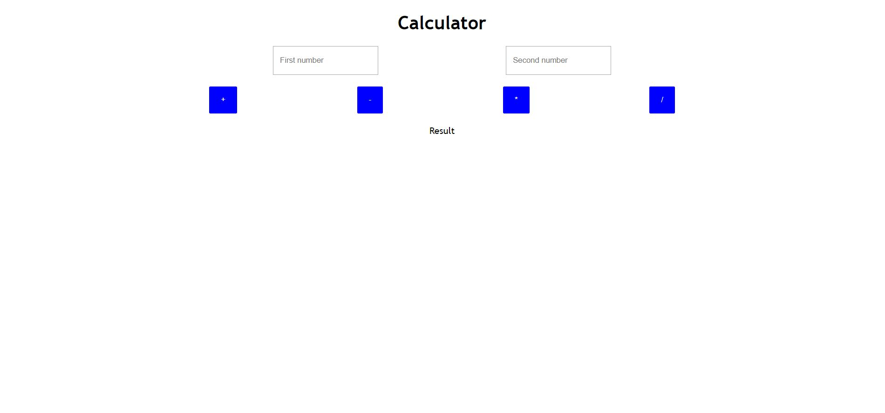
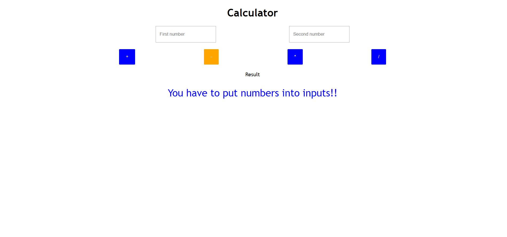
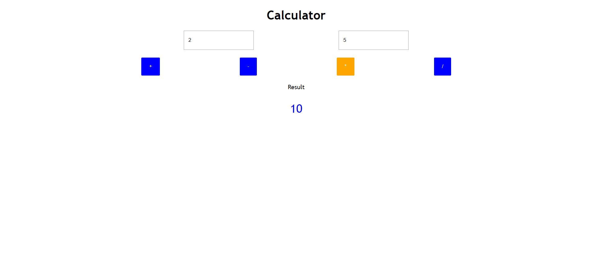

Gotowe:

- Szablon - czyli plik index.html, cała struktura dokumentu. Proszę zwrócić uwagę, że do elementów dostajemy się przez atrybuty
np. 'data-caculator-...'..

- Początek skryptu a mianowicie, zadeklarowanie zmiennych potrzebnych do operowania na dokumencie oraz obsłużone 4 wydarzenie na
kliknięcie.

Do zrobienia:
- całe style. Kalkulator ma wyglądać tak jak na załączonym obrazku. Nie można zmieniać HTML, tylko CSS.

Jak to zrobić?
- Po wykonaniu zadania, proszę stworzyć brancha o nazwie 'zadanie', wrzucić kod i stworzyć Pull Requesta.

Jak to ma działać?

1. Wpisujemy dwie liczby w dwa inputy. Inputy nie mogą być puste (jeśli będą puste, proszę wypisać ostrzeżenie).
2. Jeśli użytkownik dobrze wpisał liczby, musimy sprawdzić czy wprowadzony tekst to rzeczywiście liczby. Jeśli nie,
musimy je przekonwertować, żeby rzeczywiście były to liczby.
3. Potem jeśli mamy już liczby, wykonujemy działanie i wypisujemy wynik na ekran.

